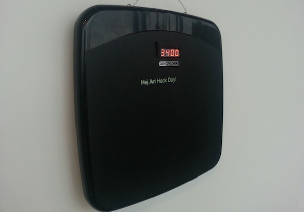

# The Weight of Words

Vikten av ord, The Weight of Words

Ever written a text that you edit over and over again? Tried your best to make it informal, not found the right words? Deleted the full message before even sending it?

The Weight of Words analyses the actions taken while a message is being typed. These actions is aggregated and translated into a physical weight in grams to represent how heavy a message got during composition.

The installation allowed visitors to type their own text to reveal the weight of it. The text were projected while typed on a scale to create a pressure that caused the digital display to increase and show the weight of the message.

This installation was created during [Art Hack Day](http://arthackday.net/stockholm/) and showed at the flash exhibit at Bonniers Konsthall April 13, 2013. During the exhibit over 300 messages got their weight determined.

## Tools

**Processing** Text editor and text analyse.

**Arduino** Control of a 7 segment display. 

### License

Copyright 2013 Johan Nilsson <http://www.markupartist.com>

Distributed under [Apache License, Version 2.0](http://www.apache.org/licenses/LICENSE-2.0.html).

